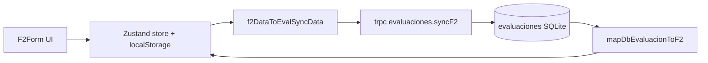

# F2 — Pipeline de sincronización (store ↔ BD)

> **Rama:** `ajustes9.2` · **Última revisión:** Junio 2026

Guía rápida para diagnosticar campos de F2 que «se borran al guardar» o no reaparecen tras recargar el expediente.

## Síntoma típico

1. El usuario edita un campo en F2 (p. ej. **Centro de Costo** en Información General).
2. El valor se ve bien en pantalla (store + localStorage).
3. Tras **Guardar** o al volver desde Historial, el campo vuelve vacío.

## Dos causas distintas (no confundir)

| Causa | Ejemplo | Qué fallaba |
|-------|---------|-------------|
| **A. Snapshot derivado al guardar** | Hardware / Materiales / RRHH (antes del fix cuotas) | `guardar()` enviaba o persistía un array **derivado** (vista UI) en lugar del **store** real → filas extra o datos efímeros se perdían. |
| **B. Campo ausente en pipeline BD** | `centroCostoHeader` | El campo existía en `F2Data` y en la UI, pero **no** en `f2DataToEvalSyncData` / `mapDbEvaluacionToF2` / columna SQLite → tras `invalidate` el detalle desde BD pisaba el store sin ese valor. |

## Reglas de oro

1. **Fuente de verdad al guardar:** siempre el objeto mergeado del store (`freshData` + override de tablas si aplica), nunca solo la vista derivada (`deriveFilasCosto`, etc.).
2. **Tras éxito de sync:** `storeGuardarF2` debe recibir el **`F2Data` completo** guardado (`dataToSave`), no un `Partial` que omita encabezados.
3. **Campo nuevo en F2 encabezado:** checklist en 4 capas:
   - `F2Data` + UI (`F2InfoGeneral`)
   - `F2_SYNC_SCALAR_KEYS` en [`fromServer.ts`](../client/src/features/expedientes/fromServer.ts)
   - `EvaluacionInputSchema` + `syncF2` `basePatch` en [`server/routers.ts`](../server/routers.ts)
   - Columna en [`drizzle/schema.ts`](../drizzle/schema.ts) + migración + `tryAlter` en [`server/db.ts`](../server/db.ts)
4. **Tablas de costos:** arrays `hardware` / `materiales` / `rrhh` / `otrosGastos` van en el payload de sync; la **derivación** solo ordena/filtra para render, no define qué se persiste.

## Archivos clave

| Archivo | Rol |
|---------|-----|
| [`client/src/features/expedientes/fromServer.ts`](../client/src/features/expedientes/fromServer.ts) | `F2_SYNC_SCALAR_KEYS`, `f2DataToEvalSyncData`, `mapDbEvaluacionToF2` |
| [`client/src/features/expedientes/f2/useF2.ts`](../client/src/features/expedientes/f2/useF2.ts) | `guardar()` → merge store, `sanitizeF2Cuotas`, sync, `storeGuardarF2(dataToSave)` |
| [`client/src/features/expedientes/f2/F2Form.tsx`](../client/src/features/expedientes/f2/F2Form.tsx) | Override de arrays al guardar; encabezado vía `update()` directo al store |
| [`client/src/features/expedientes/f2/f2RowDerivation.ts`](../client/src/features/expedientes/f2/f2RowDerivation.ts) | Derivación multi-fila por cuota (solo vista) |

## Fix aplicado: `centroCostoHeader`

- Columna `centroCostoHeader` en tabla `evaluaciones` (migración `0013`).
- Incluido en sync e hidratación vía `F2_SYNC_SCALAR_KEYS`.
- `storeGuardarF2` recibe el documento F2 completo tras guardar.

## Auditoría expediente (Jun 2026)

| Slot | Riesgo similar | Estado |
|------|----------------|--------|
| **F1** | Campos solo en UI sin `f1Datos` | Mitigado: `syncF1` guarda snapshot `f1Datos` JSON completo |
| **F2 encabezado** | Escalar fuera de pipeline | **Corregido** `centroCostoHeader`; resto en `F2_SYNC_SCALAR_KEYS` |
| **F2 tablas costo** | Guardar vista derivada | **Corregido** en 9.2: store + multi-fila por cuota |
| **F2 Otros** | Ítems placeholder en derive | Aceptado: `deriveFilasOtros` genera plantillas; se persisten al guardar si tienen datos |
| **F3** | Calculado, no editable | Sin sync de formulario; depende de F1+F2 correctos |

### Campos F2 a vigilar al agregar features

Cualquier nuevo campo en `F2Data` que no sea `hardware` / `materiales` / `rrhh` / `otrosGastos` / `firmaImagen` debe seguir el checklist de 4 capas. Hoy los escalares sincronizados están listados en `F2_SYNC_SCALAR_KEYS`.

## Tests

- [`fromServer.test.ts`](../client/src/features/expedientes/fromServer.test.ts) — round-trip `centroCostoHeader`
- [`f2RowDerivation.test.ts`](../client/src/features/expedientes/f2/f2RowDerivation.test.ts) — multi-fila por cuota

## Verificación manual

1. F2 → Información General → elegir **Centro de Costo** del catálogo.
2. Guardar F2.
3. Ir a Historial y volver al expediente (o refrescar detalle).
4. El CECO debe seguir seleccionado.
