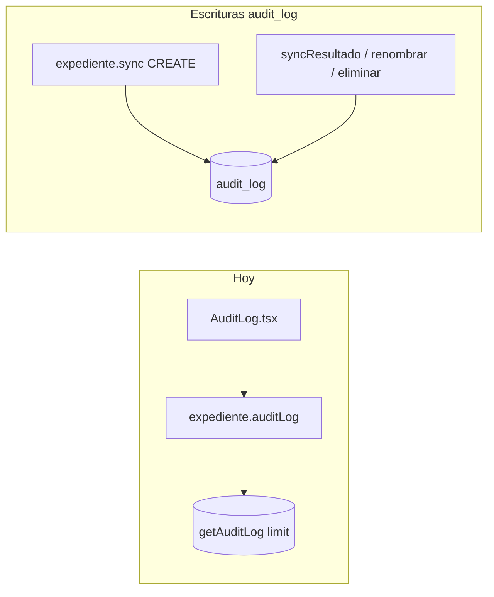

# Plan: auditoría completa, rendimiento y filtros

## Cómo funciona hoy (diagnóstico)

- **No hay interceptor global de CRUD.** Cada acción auditada requiere una llamada explícita a [`createAuditLog`](c:/Users/PC1/Desktop/P/cdlatam_webform/server/db.ts) en el backend.
- **Únicas escrituras actuales:** en [`server/routers.ts`](c:/Users/PC1/Desktop/P/cdlatam_webform) dentro de `expediente.sync` (solo cuando **se inserta** un expediente nuevo), `syncResultado`, `renombrar` y `eliminar`. No se llama desde `localAuth.login` / `logout`, catálogos, usuarios, cláusulas/PDF ni `syncF1` / sync de actas/EP.
- **Creación de expediente “que no ves”:** en `expediente.sync`, si `getExpedienteByUuid` ya encuentra fila, se hace `return` **sin** `createAuditLog` ([líneas ~1072–1077](c:/Users/PC1/Desktop/P/cdlatam_webform/server/routers.ts)). Eso es lo habitual tras el primer sync del mismo UUID.
- **Modelo de datos:** [`audit_log`](c:/Users/PC1/Desktop/P/cdlatam_webform/drizzle/schema.ts) ya tiene `userId`, `username`, `action`, `entity`, `entityId` (entero), `changes` (JSON), `ip`, `createdAt`. El “ID de expediente” que negocio suele usar es el **UUID**; en CREATE de expediente hoy va dentro de `changes.after.uuid`, no como columna dedicada. La pantalla [`client/src/pages/AuditLog.tsx`](c:/Users/PC1/Desktop/P/cdlatam_webform/client/src/pages/AuditLog.tsx) muestra `entityId` pero **no** `userId` ni el UUID de forma explícita.
- **Consulta:** [`getAuditLog(limit)`](c:/Users/PC1/Desktop/P/cdlatam_webform/server/db.ts) devuelve los últimos N ordenados por fecha, **sin filtros en SQL**. La UI aplica un filtro de texto **solo sobre esos N registros** cargados, lo cual no escala y no equivale a “últimas 6 horas del sistema completo”.
- **Rendimiento:** la migración [`0006_expedientes_actas_link.sql`](c:/Users/PC1/Desktop/P/cdlatam_webform/drizzle/migrations/0006_expedientes_actas_link.sql) crea `audit_log` sin índices; las búsquedas por rango de fechas beneficiarán de un índice sobre `createdAt` (y opcionalmente compuestos según filtros reales).

## Objetivos

1. **Cobertura:** login/logout (y opcional intentos fallidos), CRUD relevante de cláusulas/PDF, operaciones sensibles de usuarios/roles, y catálogos (al menos bulk o resumen por petición).
2. **Expediente trazable:** que en listado y filtros se vea **UUID y/o código** además del `entityId` numérico, sin depender solo de abrir `changes`.
3. **Filtros potentes y rápidos:** presets (6 h, hoy, ayer, semana, rango) y filtros por acción, usuario, entidad, expediente — **resueltos en SQL con límite + cursor o paginación**, no filtrando miles de filas en el cliente.
4. **UI:** columnas `userId`, identificador de expediente, IP opcional; controles de preset + rango; autocompletar usuario desde lista admin si hace falta.

## Por qué “duele” si `createAuditLog` ya existe (y cómo arreglarlo bien)

**La tabla y `createAuditLog` sí son un único sumidero de datos; lo esparcido son los *call sites*.** Eso complica tres cosas: (1) cada nueva mutación puede olvidar el log; (2) cada sitio puede rellenar campos distintos (IP, `userId`, `expedienteUuid`); (3) revisar cobertura implica buscar en muchos routers/archivos.

**Remedio profesional (por capas, sin over-engineering para este repo):**

1. **Capa de conveniencia (imprescindible):** un módulo pequeño, p. ej. `server/audit/record.ts`, con una función `recordAudit(ctx, { action, entity, entityId, expedienteUuid?, changes? })` que:
   - unifique `userId` / `username` desde `ctx.user` (y mismo criterio que `expediente.sync` donde hoy se usa `localUser`);
   - extraiga `ip` de `ctx.req` de forma consistente;
   - delegue en `createAuditLog` (o renombre interno) para que **solo ahí** se serialice `changes` y límites de tamaño/redacción si hace falta.

2. **Regla de equipo:** toda mutación “sensible” termina con **una línea** `void recordAudit(...)` o `await recordAudit(...)` junto al éxito de la operación; en code review se chequea igual que permisos.

3. **Opcional (fase 2):** *procedure builder* o middleware tRPC solo donde tenga sentido (p. ej. router `catalogsDB` con metadata por ruta); evita middleware global ciego que no sabe `entity`/`entityId` sin anotación explícita.

4. **No recomendado aquí:** auditar todo vía hooks SQL/Drizzle sobre cada `UPDATE` — genera ruido masivo (autosaves) y mezcla “cambio técnico” con “acción de negocio”.

Con (1)+(2), aplicar las mejoras del **schema** (`expedienteUuid`, índices) y de la **query** filtrada sigue siendo directo: un solo tipo de payload entrante al insert y un solo procedimiento de lectura.

## Diseño propuesto

### A) API tRPC y consulta

- Sustituir / complementar `expediente.auditLog` con un procedimiento dedicado (p. ej. `system.auditLog.list` o `audit.list`) **solo admin/manager**, con input Zod:
  - `from` / `to` (epoch segundos o ISO normalizado a UTC),
  - `actions[]`, `entities[]`, `userId`, `username` (substring opcional),
  - `expedienteUuid` (substring exacto o prefijo),
  - `limit` (cap razonable, p. ej. 500) y `cursor` (id + createdAt para keyset pagination).
- Implementar en [`server/db.ts`](c:/Users/PC1/Desktop/P/cdlatam_webform/server/db.ts) `getAuditLogFiltered(...)` con `where`/`and` dinámicos Drizzle + `orderBy(desc(createdAt), desc(id))` + `limit`.
- **Índice:** `CREATE INDEX IF NOT EXISTS idx_audit_created_at ON audit_log(createdAt DESC)` (y, si filtras mucho por usuario, `idx_audit_user_created (userId, createdAt DESC)`).

### B) Esquema (opcional pero recomendado)

- Añadir columna nullable **`expedienteUuid` TEXT** (y opcionalmente `expedienteCodigo` TEXT) en `audit_log` para filtros y listados sin parsear JSON.
- Migración Drizzle + `tryAlter` en [`runMigrations`](c:/Users/PC1/Desktop/P/cdlatam_webform/server/db.ts) para BDs ya desplegadas.
- Al escribir logs de expediente (CREATE/UPDATE/DELETE/resultado), rellenar siempre esa columna además de `changes`.
- **Ampliar tipo de `action`:** hoy TypeScript limita a `"LOGIN" | "LOGOUT" | ...` en [`createAuditLog`](c:/Users/PC1/Desktop/P/cdlatam_webform/server/db.ts); usar unión más amplia o `string` con convención documentada (`LOGIN_FAILED`, `UPLOAD`, `DOWNLOAD` si aplica).

### C) Instrumentación (orden sugerido)

| Área | Dónde enganchar | Notas |
|------|-----------------|--------|
| Login / logout | [`localAuth.login` / `logout`](c:/Users/PC1/Desktop/P/cdlatam_webform/server/routers.ts) | Tras éxito: `LOGIN` con `userId`, `username`, `ip` desde `ctx.req`. Logout: mejor `LOGOUT` solo si había cookie válida (opcional). Intentos fallidos: fila con `userId` null y `username` + `LOGIN_FAILED` (cuidado de no spamear: rate limit o solo últimos N por IP). |
| Cláusulas PDF | [`server/routers/clausulas.ts`](c:/Users/PC1/Desktop/P/cdlatam_webform/server/routers/clausulas.ts) + [`server/routes/clausulas-upload.ts`](c:/Users/PC1/Desktop/P/cdlatam_webform/server/routes/clausulas-upload.ts) | `entity: "catalog_clausulas"` o `"clausula_pdf"`, `entityId` = id fila, `changes` con `fileName`/`filePath` resumido. |
| Usuarios / roles | Mutations `localAuth.*` y router de roles si existe | CREATE/UPDATE/toggle password. |
| Catálogos | Procedures `catalogsDB` / bulk en [`server/routers.ts`](c:/Users/PC1/Desktop/P/cdlatam_webform/server/routers.ts) | Una fila por operación bulk con `changes: { tableName, count }` evita miles de inserts. |
| Actas / EP | `syncF1` y equivalentes | **Alto volumen:** auditar solo eventos significativos (primera creación acta, cambio de status a completado/exportado) o muestreo; evitar un log por cada autosave. |

### D) UI [`AuditLog.tsx`](c:/Users/PC1/Desktop/P/cdlatam_webform/client/src/pages/AuditLog.tsx)

- Chips o select para presets que calculan `from`/`to` en el cliente y disparan la query con `keepPreviousData` / staleTime para no “lentear”.
- Campos: acción (multi), entidad (multi), usuario (`userId` o texto), expediente (UUID o código).
- Tabla: columnas **Usuario (`username` + `userId`)**, **Expediente** (uuid/código si existen), **Acción**, **Entidad**, **ID entidad**, **IP**, **Fecha**, **Detalles** (`changes`).
- Paginación “Cargar más” con `cursor` devuelto por el servidor.

### E) Retención (futuro cercano, opcional)

- Job o cron que borre filas más viejas de X días si la tabla crece; documentar en comentario de schema.

## Riesgos y mitigaciones

- **Volumen:** actas con autosave → auditar solo hitos o resumir.
- **Seguridad:** no guardar contraseñas ni tokens en `changes`; PDF paths ya son relativos.
- **Coherencia `ctx.user` vs `ctx.localUser`:** unificar en logs el mismo origen de `userId` que el resto del expediente (hoy `sync` usa `localUser` y otros usos `ctx.user`).

## Criterios de aceptación

- Tras login/logout de un usuario admin, aparecen filas `LOGIN` / `log` en auditoría con IP cuando esté disponible.
- Subir/eliminar cláusula genera fila auditable con identificación clara.
- Filtro “últimas 6 horas” devuelve resultados correctos aunque haya más de 200 eventos en el sistema (paginación o límite alto acotado en SQL).
- Listado muestra **userId** y **identificador de expediente** (uuid/código) cuando aplique.
